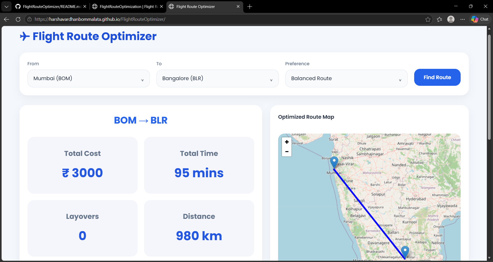
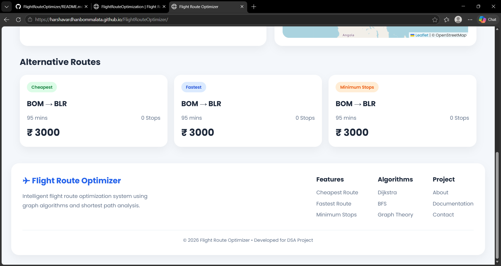
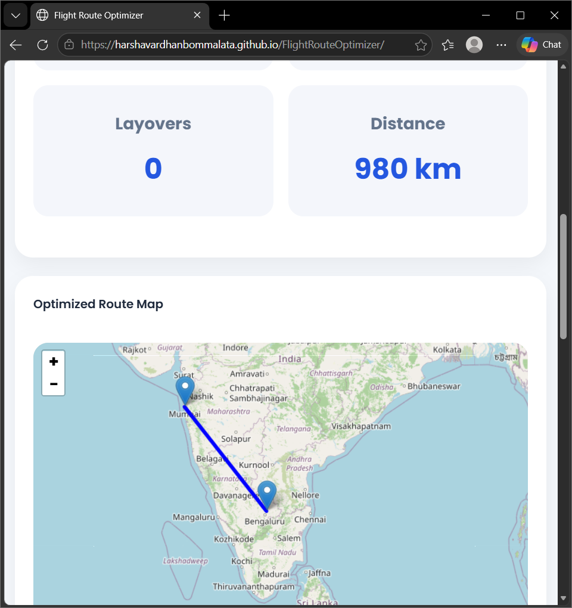

# FlightRouteOptimizer
# ✈ Flight Route Optimization

Flight Route Optimization is a web application built using Data Structures and Algorithms (DSA). The project helps users find the best flight route between Indian airports based on different preferences like lowest cost, fastest travel time, minimum stops, shortest distance, and balanced route.

The project also shows the selected route visually on a real-time interactive map.

---

# 📌 Introduction

Nowadays, people travel between cities using flights very frequently. While booking flights, different users may have different needs.

For example:

* Some users want the cheapest ticket.
* Some users want the fastest journey.
* Some users want fewer layovers.
* Some users want the shortest travel distance.

Finding the best route manually becomes difficult when there are many airports and multiple flight connections.

This project solves that problem using graph algorithms.

In this project:

* Airports are treated as nodes.
* Flight routes are treated as edges.
* Each route contains:

  * Cost
  * Time
  * Distance

The system calculates optimized routes automatically and displays them to the user.

---

# ❗ Problem Statement

Flight networks are large and complex. One airport can connect to many other airports, and each route may have:

* Different ticket prices
* Different travel times
* Different layovers
* Different distances

Example:

A user wants to travel from:

```text id="tfn4uv"
Hyderabad → Delhi
```

Possible routes:

```text id="p5zljq"
HYD → DEL
```

or

```text id="x3ncbv"
HYD → BOM → DEL
```

or

```text id="r8gpta"
HYD → BLR → DEL
```

Each route has different:

* Cost
* Time
* Distance

The challenge is to automatically find the best route according to user preference.

---

# 💡 Solution Idea

The project uses graph-based algorithms to solve the routing problem.

## Graph Representation

* Airports → Nodes
* Routes → Edges

Example:

```javascript id="xr34cq"
{
    from: "HYD",
    to: "DEL",
    cost: 7800,
    time: 165,
    distance: 1500
}
```

This means:

```text id="df4uob"
Hyderabad → Delhi
Cost = ₹7800
Time = 165 mins
Distance = 1500 km
```

The project creates a graph from all airports and routes.

---

# ⚙ How the Project Works

## Step 1 — User Selects Airports

The user selects:

* From Airport
* To Airport
* Optimization Preference

Example:

```text id="mmdc4d"
FROM: Hyderabad
TO: Delhi
PREFERENCE: Cheapest Route
```

---

## Step 2 — Graph Creation

The system creates a graph using all airports and routes.

Example:

```text id="nd7a9h"
HYD → BOM
HYD → BLR
BOM → DEL
BLR → DEL
```

---

## Step 3 — Algorithm Runs

Different algorithms are used for different preferences.

---

# 🧠 Algorithms Used

## 1. Cheapest Route — Dijkstra Algorithm

This algorithm finds the route with minimum total ticket cost.

Example:

```text id="kglnrh"
HYD → BOM → DEL
```

Cost:

```text id="gwnu8g"
₹5300
```

Instead of direct:

```text id="rmu2ra"
HYD → DEL = ₹7800
```

So the cheaper route is selected.

---

## 2. Fastest Route — Dijkstra Algorithm

This algorithm finds the route with minimum travel time.

Example:

```text id="yn9qzr"
HYD → DEL
```

Time:

```text id="efmkd6"
165 mins
```

Even if cost is higher, the fastest route is selected.

---

## 3. Minimum Stops — BFS Algorithm

This algorithm finds the route with the fewest layovers.

Example:

```text id="r7u4cm"
HYD → DEL
```

Stops:

```text id="fpjlwm"
0 Stops
```

Instead of:

```text id="vh7ndq"
HYD → BOM → DEL
```

which has:

```text id="zq5ysh"
1 Stop
```

---

## 4. Shortest Distance — Dijkstra Algorithm

This algorithm finds the route with minimum total distance.

Example:

```text id="rkgj95"
HYD → DEL
```

Distance:

```text id="xh68c3"
1500 km
```

---

## 5. Balanced Route — Weighted Dijkstra

This route balances:

* Cost
* Time
* Distance

It gives a route that is overall efficient.

Example:

```text id="xqk8wb"
Medium cost
Medium time
Medium distance
```

instead of only optimizing one factor.

---

# 🗺 Map Visualization

The project also visualizes routes on an interactive map.

The system uses:

* Latitude
* Longitude

of airports.

Example:

```javascript id="d0zjlwm"
{
    code: "HYD",
    lat: 17.2403,
    lng: 78.4294
}
```

When a route is selected:

```text id="h45m7n"
HYD → BOM → DEL
```

the map:

* Places airport markers
* Draws route lines
* Zooms automatically

This gives a real flight route experience.

---

# 📊 Route Information Displayed

The system displays:

* Total Cost
* Total Time
* Total Distance
* Number of Layovers
* Alternative Routes

Example:

```text id="ocysru"
Total Cost: ₹5300
Total Time: 210 mins
Distance: 1770 km
Stops: 1
```

---

# 🛠 Technologies Used

* HTML
* CSS
* JavaScript
* Leaflet.js
* OpenStreetMap

---

# 🌟 Features

* 50+ Indian Airports
* Real-time Route Optimization
* Interactive Flight Map
* Cheapest Route Finder
* Fastest Route Finder
* Minimum Stops Detection
* Balanced Route Recommendation
* Alternative Route Cards
* Responsive Design
* Dynamic UI Updates

---

# 📸 Project Screenshots

## Home Page



---

## Route Optimization Result



---

## Interactive Route Map



---

# ▶ How to Run the Project

1. Clone the repository:

```bash id="j8m2qx"
git clone <https://github.com/harshavardhanBOMMALATA/FlightRouteOptimizer.git>
```

2. Open the project folder:

```bash id="p4k7mw"
cd flight-route-optimization
```

3. Open the folder in VS Code.

4. Install the Live Server extension in VS Code.

5. Right click on:

```text id="n5v1zt"
index.html
```

and select:

```text id="r7x3qp"
Open with Live Server
```

6. The project will open automatically in your browser.

---

# 🎯 Conclusion

Flight Route Optimization shows how DSA and graph algorithms can solve real-world travel problems.

The project demonstrates:

* Graph Representation
* Dijkstra Algorithm
* BFS Algorithm
* Route Optimization
* Interactive Visualization

It combines algorithms with frontend development to create a practical and user-friendly flight optimization system.

---

# 👨‍💻 Developed By

Harshavardhan

* LinkedIn: [Harshavardhan LinkedIn](https://www.linkedin.com/in/harshavardhan-bommalata-7bb9442b0/?utm_source=chatgpt.com)
* Gmail: [hbommalata@gmail.com](mailto:hbommalata@gmail.com)
* Instagram: [always_harsha_royal Instagram](https://www.instagram.com/always_harsha_royal/?hl=en&utm_source=chatgpt.com)

